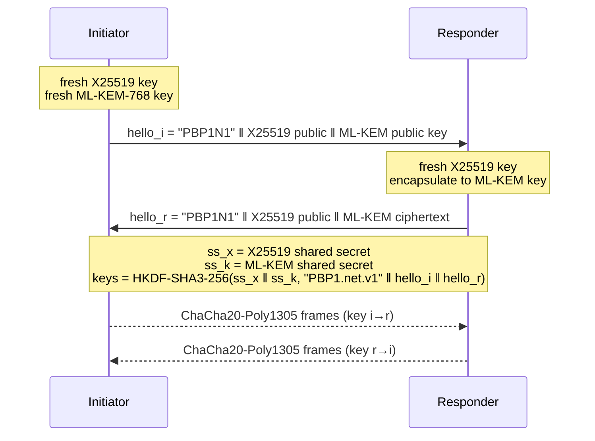

# hybride-pq

**Hybrid post-quantum signatures, encrypted connections and password-protected key
storage, built only from standardized, publicly reviewed cryptography.**

[](https://github.com/JamievanRiel/hybride-pq/actions/workflows/tests.yml)


hybride-pq implements **PBP-1**, a small cryptographic protocol with one rule at its
core: *nothing may depend on a single thing going right*. Wherever it matters, two
schemes built on different hardness assumptions protect the data, and an attacker has
to break both.

> [!WARNING]
> **An honest security statement comes first.** Every cryptographic *primitive* used
> here is standardized (NIST FIPS 202/203/204/205, IETF RFC 5869/7748/8439/9106) and
> has been studied in public for years. The way PBP-1 *combines* them has **not** been
> reviewed by independent cryptographers. This is an educational, carefully documented
> reference design. Don't use it to protect real money, real users or safety-critical
> data until such a review has happened. If you need production cryptography today,
> read [Should I use this?](#should-i-use-this) first.

## Contents

- [What's inside](#whats-inside)
- [Why it is built this way, and why that makes it strong](#why-it-is-built-this-way-and-why-that-makes-it-strong)
- [Security levels at a glance](#security-levels-at-a-glance)
- [What it does NOT protect against](#what-it-does-not-protect-against)
- [Should I use this?](#should-i-use-this)
- [Installation](#installation)
- [Quick start](#quick-start)
- [API overview](#api-overview)
- [Formats and performance](#formats-and-performance)
- [Tests](#tests)
- [Origin, security reports and license](#origin-security-reports-and-license)

## What's inside

| Building block | What it gives you | Algorithms |
|---|---|---|
| **Hybrid signatures**: `sign`, `verify` | Proof of who wrote a message and that nobody changed it | ML-DSA-65 **and** SLH-DSA-SHAKE-128s |
| **Secure channel**: `SecureChannel` | An encrypted, tamper-evident connection between two programs, optionally with mutual authentication | X25519 **+** ML-KEM-768 → HKDF-SHA3-256 → ChaCha20-Poly1305 |
| **Keystore**: `keystore.save` / `load` | A secret key on disk, locked with a passphrase | Argon2id → ChaCha20-Poly1305 |
| **Hash**: `sha3_256` | Fingerprints of data | SHA3-256 |

## Why it is built this way, and why that makes it strong

Good cryptographic design starts from pessimism. Instead of hoping every part works,
PBP-1 assumes parts **will** fail and makes sure one failure is never enough.

### The threat model: what we assume can go wrong

1. **A standard can be weakened on purpose.** Dual_EC_DRBG, a NIST-standardized random
   number generator, very likely contained a backdoor. NIST told everyone to stop using
   it in 2013.
2. **A mathematical assumption can collapse overnight.** In 2022 two candidates from
   NIST's post-quantum standardization process fell to ordinary computers: the SIKE key
   exchange (its main parameter set in roughly an hour on a single CPU core) and the
   Rainbow signature scheme ("Breaking Rainbow Takes a Weekend on a Laptop").
3. **An implementation can be buggy or compromised.** Correct math does not help when
   the code around it leaks. Heartbleed (OpenSSL, 2014) is the classic example.
4. **Large quantum computers will arrive at some point.** Shor's algorithm breaks RSA
   and every elliptic-curve scheme (X25519, Ed25519, ECDSA). Traffic that someone
   records *today* can be decrypted *then*. This is called "harvest now, decrypt later".
5. **Files get stolen and passwords get guessed.** A stolen keystore can be attacked
   offline, on GPUs, for as long as the attacker likes.
6. **The network is hostile.** Anyone on the path can read, change, replay, reorder,
   drop or inject data, or pretend to be the other side.

Each design decision below answers one or more of these threats.

### 1. Hybrid signatures: two locks from two different locksmiths

Every PBP-1 signature is really two signatures over exactly the same bytes:

| | ML-DSA-65 (FIPS 204) | SLH-DSA-SHAKE-128s (FIPS 205) |
|---|---|---|
| Security rests on | Hard problems in *module lattices* (plus the hash functions it uses internally) | Only the security of the hash function SHAKE256 |
| Strength | Fast, reasonably compact | The most conservative assumption in public-key cryptography: there's no algebraic structure to attack or to hide a trapdoor in |
| NIST category | 3 | 1 |

A PBP-1 signature is valid **only if both halves verify**, and the public key commits
to both halves. So a forger has to break the lattice scheme **and** the hash-based
scheme, for the same message and the same key. If someone finds a lattice attack
tomorrow (the way SIKE and Rainbow fell), SLH-DSA still holds. If someone finds a flaw
in SLH-DSA, ML-DSA still holds. Against forging a signature, the combination is at
least as strong as the *stronger* of the two (threats 1–4).

Some details, including the fine print:

- **No shared pre-hash.** Each scheme signs the message itself. If both signed a hash
  of the message computed by PBP-1, that hash would become a single point of failure.
  The halves are not fully independent, though: both use SHAKE (Keccak) internally, as
  do ML-KEM and SHA3. A catastrophic break of Keccak would hurt both halves at once.
- **Randomized ("hedged") signing.** Signing the same message twice gives different
  signatures. Both schemes stay secure even if the randomness turns out to be poor. It
  also means **a signature is not a unique fingerprint of a message**, so don't use
  signature bytes as an identifier.
- **Only unforgeability is "as strong as the stronger half".** Whether someone who
  holds a valid signature can change it into another valid one depends on *both*
  halves, so for that property the combination is only as strong as the weaker one.

### 2. Two independent implementations

The math is not the only thing that can fail. ML-DSA runs in **OpenSSL** (C, through
the `cryptography` package). SLH-DSA runs in separate **Rust** code (through the
`pqcrypto` package). A bug or backdoor in one codebase is not enough to forge a PBP-1
signature (threat 3). Both halves were cross-checked against a second implementation
during development: OpenSSL 3.5's own SLH-DSA verifies the Rust-made signatures, and
the Rust ML-DSA verifies OpenSSL's.

### 3. Hybrid key exchange: safe if either half survives

When two programs connect, they agree on keys in two independent ways at the same time:



- **X25519** (RFC 7748) has decades of analysis behind it, but a quantum computer breaks it.
- **ML-KEM-768** (FIPS 203) resists quantum computers, but it is young.

Both shared secrets go into one key derivation, so **the session keys stay secret as
long as at least one of the two is unbroken**. This is the same idea as the
X25519MLKEM768 hybrid that major browsers now use for TLS 1.3. Traffic someone records
today stays unreadable to a future quantum computer unless ML-KEM falls too (threats 2, 4).

The derivation also includes **every byte of both hello messages** (the transcript).
If an attacker changes a single handshake byte, the two sides end up with different
keys, and the very first message fails to decrypt (threat 6).

### 4. Forward secrecy

Both sides create brand-new key-exchange keys for every connection and throw them away
after the handshake. No long-term encryption key exists. Stealing a signing key or a
keystore later does not decrypt connections that were recorded earlier (threats 4, 5).

This protects connections that have *ended*. While a connection is open, its traffic
keys sit in memory. Python can't reliably wipe them, and there's no rekeying, so
someone who takes over a machine mid-connection can read that whole connection.

### 5. Every message is sealed

After the handshake, every message is encrypted with **ChaCha20-Poly1305** (RFC 8439)
and carries a 16-byte authentication tag:

- **Separate keys per direction**, so a message can never be reflected back to its sender.
- **The nonce is a message counter.** It never repeats (nonce reuse is the classic way
  to break this cipher). The receiver always expects the next number, so a **replayed,
  reordered, injected or missing message** makes the next receive fail. A connection
  that is simply cut off at the end is not detected this way (see the limitations).
- **Fail closed.** After a failed receive (including one that was cancelled halfway),
  a failed send or a failed `authenticate`, the channel refuses all further use. Unlike
  TLS, no alert is sent: the peer notices when the connection closes or its next
  receive fails.
- A frame header announcing more than 8 MiB is rejected *before* the memory is allocated.

### 6. Knowing *who* is on the other end: session binding

A key exchange by itself proves that *someone* is on the other end, not *who*. An
active attacker could run two handshakes and sit in the middle. That's why each side
can call `await channel.authenticate(my_keys, their_public_key)` right after the
handshake:

- Every channel has a `session_id`: 32 bytes derived together with the traffic keys.
  An attacker who wants to read or change the traffic has to run a separate handshake
  with each side, and then the two ids differ. (Just relaying the bytes unchanged
  keeps the ids equal, but then the attacker learns nothing and can change nothing.)
- Each side signs a **session proof** with its PBP-1 key. The proof covers the
  `session_id`, its own role (initiator or responder), and the fingerprints of **both**
  public keys. So a proof can't be relayed to another connection, reflected back to
  its maker, or presented to a peer it wasn't meant for.
- Proofs are signed under their own FIPS 204/205 **context string** (`PBP1.auth.v1`).
  No ordinary `sign()` signature can ever pass as a session proof, and no session proof
  can pass as an ordinary signature, even over identical bytes.
- **The initiator proves first.** The responder (usually a server) only signs after
  the initiator's proof checks out, so an anonymous connection can't make the server
  spend CPU on signing. A responder may pass several allowed client keys, and
  `authenticate` returns the one that matched.
- **On failure the connection is closed**, and the channel can't be used any more.

The result is a channel that uses post-quantum algorithms for both secrecy and
authentication. It does have limits, listed below: for example, an active attacker
learns which key the initiator uses. [See the example.](#an-encrypted-and-authenticated-connection)

### 7. A keystore that makes guessing expensive

A passphrase is not a key: people choose guessable ones, and a stolen file can be
attacked offline (threat 5). The keystore defends against that in layers:

- **Argon2id** (RFC 9106) turns the passphrase into a key. Argon2 won the Password
  Hashing Competition; Argon2id is its recommended variant. PBP-1 uses RFC 9106's
  second recommended setting: **64 MiB of memory and 3 passes for every single guess**.
  The memory requirement matters most. GPUs and custom chips are fast because they run
  thousands of tiny computations in parallel, and each Argon2id guess needs its own 64 MiB.
- **A fresh random 128-bit salt for every save.** Precomputed tables are useless, and
  the same passphrase gives a different key in every file.
- **ChaCha20-Poly1305 with the version label as associated data.** Changing the
  ciphertext, salt, nonce, version label or any Argon2 parameter makes decryption fail.
  (Cosmetic changes such as upper-case hex or extra JSON fields are ignored.)
- **One error for "wrong passphrase" and "tampered file".** Cryptographically they look
  the same, and the library doesn't pretend otherwise.
- **Defensive loading.** The Argon2 parameters in a file are checked against limits
  (at most 1 GiB, 16 passes, 16 lanes), and odd types, deep nesting and bad encodings
  become a clean `KeystoreError`.
- **Careful writing.** The file is written atomically, so a crash never leaves half a
  keystore, and synced to disk. On Linux and macOS only the owner can read it (`0600`).
  Saving with an empty passphrase is refused.

Argon2id makes each guess expensive, but it can't rescue a weak passphrase. Use a long
random one. Six random words from the Diceware list give about 77 bits of entropy.

### 8. No home-made cryptography, randomness or magic constants

- **No new primitives.** PBP-1 only *combines* standardized building blocks. It
  invents no cipher, hash or signature scheme.
- **No random generator of its own.** All randomness comes from the operating system's
  CSPRNG. Dual_EC_DRBG showed that a random generator is an attractive place to hide a
  backdoor, so PBP-1 adds nothing there, and hedged signing keeps signatures safe even
  if the randomness is poor.
- **No unexplained constants.** The only constants PBP-1 adds are readable ASCII labels
  such as `PBP1` and `PBP1.sig.v1`. The primitives come from open competitions or open
  standardization processes and use constants that anyone can re-derive.

### 9. Domain separation and strict parsing

- **Every purpose gets its own label.** Signatures sign `"PBP1.sig.v1\0" ‖ message`,
  key derivation uses `"PBP1.net.v1"`, and session proofs use their own context string
  on top of their own label. A signature or key made for one of these purposes is never
  valid for another. The tests check this, and also that raw ML-DSA and SLH-DSA
  signatures over the bare message are rejected.
- **Fixed, self-describing encodings.** Every key and signature starts with `PBP1` plus
  a suite byte and has one exact length. Anything else is rejected with
  `MalformedEncoding` before any cryptography runs.

### 10. Built to be replaced and to be checked

- **Crypto agility.** The suite byte and the versioned keystore format mean an algorithm
  can be swapped for a new suite without making old data unreadable or ambiguous.
- **Known-answer test vectors** in [`tests/vectors/`](tests/vectors) pin the formats of
  signatures, keystore files, the handshake key derivation, the frame encryption and
  the session proofs. An accidental change to any of them fails the test suite.
- **Everything is open.** The full byte-level specification is in
  [`docs/PROTOCOL.md`](docs/PROTOCOL.md).

## Security levels at a glance

| Component | Classical security | Against a quantum computer | Rests on |
|---|---|---|---|
| ML-DSA-65 | NIST category 3 (≈ AES-192) | category 3 | module lattices |
| SLH-DSA-SHAKE-128s | NIST category 1 (≈ AES-128) | category 1 | the hash function SHAKE256 |
| ML-KEM-768 | NIST category 3 (≈ AES-192) | category 3 | module lattices |
| X25519 | ≈ 128-bit | **broken** (Shor) | elliptic-curve discrete logarithm |
| ChaCha20-Poly1305 | 256-bit key | ≈ 128-bit (Grover) | the ChaCha20 permutation |
| Argon2id keystore | limited by the passphrase | limited by the passphrase | memory-hard hashing |

**Combined:** forging a PBP-1 signature means breaking *both* signature schemes.
Recovering channel keys means breaking *both* X25519 and ML-KEM-768 (assuming
HKDF-SHA3-256 is a sound key derivation function).

## What it does NOT protect against

Knowing the limits is part of the security. Please read this list before relying on
this library for anything.

**In general**

1. **No independent review.** See the warning at the top. The primitives are well
   studied, but this particular combination isn't.
2. **A compromised computer.** Malware, a keylogger or a malicious dependency on the
   same machine defeats all of this.
3. **Python memory.** Secrets live in `bytes` objects that can't be reliably wiped and
   could end up in swap or crash dumps.
4. **Side channels.** The heavy cryptography runs in native code (OpenSSL and Rust),
   and the Python glue does not branch on secret values. But nobody has measured
   timing, power or cache leakage for this combination.
5. **Young implementations.** Post-quantum code is new everywhere. The Rust crates
   behind `pqcrypto` have, by that project's own statement, not been formally audited.
   Only the signatures use two implementations; the key exchange and keystore rely on
   OpenSSL (and `argon2-cffi`) alone.

**Signatures**

6. **The halves share Keccak**, and **signatures are not unique** per message (see
   section 1). Signatures are also large (11 KB) and slow to create (about 0.65 s).
7. **No revocation or key rotation.** A leaked signing key stays valid until everyone
   stops trusting it.

**Channel**

8. **A bare channel does not know who is on the other end.** Without `authenticate` it
   only stops eavesdroppers, not an active man in the middle. Authentication is only as
   good as the way you learned the peer's public key.
9. **Session binding has limits:**
   - Proofs are ordinary non-deniable signatures.
   - The initiator proves first, so an active attacker can see its proof and test it
     against public keys they know. The initiator's identity is not hidden.
   - The protocol has no way for a client to say which key it holds. A server with
     several allowed clients passes all of them to `authenticate`, which tries each
     one (cheap: verifying takes under a millisecond).
   - Nothing else may use the channel (no `send`, no `recv`, not even from another
     task) until `authenticate` has returned on your side.
   - If you build your own flow from `sign_session` and `verify_peer`: a failed
     `verify_peer` does *not* close the channel. Close it yourself when no key matches.
10. **Metadata is visible.** Message sizes (there is no padding), timing, who talks to
    whom, and the fact that PBP-1 is used at all (a plaintext `PBP1N1` magic and fixed
    handshake sizes) can all be observed.
11. **Truncation.** An attacker can cut the connection. Every message you *did* receive
    is genuine and in order, but a closed connection does not prove the sender was
    finished. If that matters, send an explicit "done" message.
12. **Clumsy failures.** There is no explicit key confirmation. A tampered handshake,
    or two programs that both chose the same role, only shows up at the first `recv`,
    sometimes with a confusing message such as "frame too large". Two responders wait
    for each other until a timeout.
13. **Denial of service.** Apart from the 8 MiB frame limit, nothing is rate-limited.
    The handshake and `authenticate` have no built-in timeout, so wrap them in
    `asyncio.wait_for`. Cancelling a pending `recv` ends the channel. There's no
    rekeying for long-lived connections.

**Keystore**

14. **Weak passphrases** stay weak (see section 7).
15. **No Unicode normalization.** The passphrase is used as exact UTF-8. The same
    visible text typed as a different Unicode sequence (for example an "é" composed
    differently on another operating system) won't unlock the file.
16. **A crafted file can still be expensive.** Within the limits, loading one can cost
    up to 1 GiB of memory and noticeable CPU time. File permissions are enforced on
    POSIX systems only.

## Should I use this?

- **To learn how hybrid post-quantum cryptography fits together, to experiment, or as
  a readable reference:** yes, that's what it's for.
- **To protect real data in production:** use audited, widely deployed tools instead.
  Examples are TLS 1.3 with the X25519MLKEM768 hybrid (recent OpenSSL, BoringSSL or
  rustls), libsodium, age, or the Signal protocol. Consider hybride-pq there only once
  it has had an independent review.

## Installation

hybride-pq is not on PyPI. Install it from source (Python 3.10 or newer):

```bash
git clone https://github.com/JamievanRiel/hybride-pq
cd hybride-pq
python3 -m venv .venv
.venv/bin/pip install -e ".[test]"
.venv/bin/pytest
```

Dependencies: [`cryptography`](https://cryptography.io) ≥ 50 (OpenSSL: ML-DSA, ML-KEM,
X25519, ChaCha20-Poly1305, HKDF), [`pqcrypto`](https://github.com/backbone-hq/pqcrypto)
1.x (SLH-DSA) and [`argon2-cffi`](https://github.com/hynek/argon2-cffi) (Argon2id).

## Quick start

### Sign and verify

```python
from hybride_pq import InvalidSignature, KeyPair, sign, verify

keys = KeyPair.generate()
message = b"transfer 5 coins to Alice"
signature = sign(keys, message)

verify(keys.public_bytes(), message, signature)  # returns None: both halves are valid

try:
    verify(keys.public_bytes(), b"transfer 500 coins to Alice", signature)
except InvalidSignature:
    print("tampering detected")
```

### Store a secret key behind a passphrase

```python
from hybride_pq import KeyPair, KeystoreDecryptError, keystore

keys = KeyPair.generate()
keystore.save("my-key.json", keys.secret_bytes(), "six random words are a good start")

secret = keystore.load("my-key.json", "six random words are a good start")
same_keys = KeyPair.from_secret_bytes(secret)
assert same_keys.public_bytes() == keys.public_bytes()

try:
    keystore.load("my-key.json", "wrong guess")
except KeystoreDecryptError:
    print("wrong passphrase or tampered file")
```

### An encrypted and authenticated connection

Each side has its own `KeyPair` and knows the other side's **public** key in advance
(from a config file, a QR code, or a fingerprint read out over the phone):

```python
import asyncio
from hybride_pq import SecureChannel

# client
reader, writer = await asyncio.open_connection("example.org", 9000)
channel = await asyncio.wait_for(SecureChannel.initiate(reader, writer), timeout=10)
await asyncio.wait_for(channel.authenticate(client_keys, server_public_bytes), timeout=10)
await channel.send(b"hello")
reply = await channel.recv()

# server, inside the asyncio.start_server callback
channel = await asyncio.wait_for(SecureChannel.respond(reader, writer), timeout=10)
await asyncio.wait_for(channel.authenticate(server_keys, client_public_bytes), timeout=10)
request = await channel.recv()
```

`authenticate` raises `InvalidSignature` when the peer holds a different key or someone
sits in between; the connection is then closed. A server that accepts several clients
passes a list of their public keys and gets back the one that matched. A complete
runnable version is in
[`examples/authenticated_echo.py`](examples/authenticated_echo.py):

```bash
.venv/bin/python examples/authenticated_echo.py
```

## API overview

| Name | Purpose |
|---|---|
| `KeyPair.generate()` | New hybrid signing key |
| `KeyPair.public_bytes()` / `.secret_bytes()` | Encoded public key (1989 B) / secret key (101 B) |
| `KeyPair.from_secret_bytes(b)` | Restore a key pair |
| `sign(keys, message)` | 11 170-byte hybrid signature |
| `verify(public_bytes, message, signature)` | `None`, or raises `InvalidSignature` / `MalformedEncoding` |
| `keystore.save(path, secret, passphrase)` | Encrypt and write a secret |
| `keystore.load(path, passphrase)` | Read and decrypt; raises `KeystoreDecryptError` / `KeystoreError` |
| `await SecureChannel.initiate(reader, writer)` | Handshake as the connecting side |
| `await SecureChannel.respond(reader, writer)` | Handshake as the accepting side |
| `await channel.authenticate(my_keys, peer_key_or_keys)` | Mutual authentication right after the handshake; returns the peer key that matched |
| `await channel.send(data)` / `await channel.recv()` | Send / receive one message (≤ 8 MiB) |
| `channel.session_id` | 32 bytes shared only by the two real endpoints |
| `channel.sign_session(my_keys, peer_pk)` / `channel.verify_peer(my_pk, peer_pk, proof)` | The building blocks of `authenticate`, for custom flows |
| `sha3_256(data)` | SHA3-256 digest |

Errors caused by the data (malformed keys, invalid signatures, broken or tampered
files, failed connections) are all subclasses of `PBP1Error`. Programming mistakes,
such as passing a `str` where `bytes` are expected, raise the usual `TypeError`.

## Formats and performance

| Object | Size | Layout |
|---|---|---|
| Public key | 1 989 B | `"PBP1"` ‖ `0x01` ‖ ML-DSA pk (1952) ‖ SLH-DSA pk (32) |
| Secret key | 101 B | `"PBP1"` ‖ `0x01` ‖ ML-DSA seed (32) ‖ SLH-DSA sk (64) |
| Signature / session proof | 11 170 B | `"PBP1"` ‖ `0x01` ‖ ML-DSA sig (3309) ‖ SLH-DSA sig (7856) |
| Handshake | 1 222 B + 1 126 B | see [`docs/PROTOCOL.md`](docs/PROTOCOL.md) |
| Channel overhead | 20 B per message | 4-byte length + 16-byte tag |

Measured on a 12th-gen Intel Core i5-12450H laptop with Python 3.14 (medians):

| Operation | Time |
|---|---|
| Generate a key pair | ~ 90 ms |
| Sign | ~ 650 ms (almost all SLH-DSA: the "s" variant trades signing speed for smaller signatures) |
| Verify | < 1 ms |
| Keystore save / load | ~ 60 / 50 ms |
| Channel handshake (local, without `authenticate`) | < 1 ms |
| Channel throughput (local) | ~ 400 MiB/s |

The trade-off is intentional: signatures are big and slow to create, but verifying one
(the thing that happens most) is cheap.

## Tests

```bash
.venv/bin/pytest
```

The suite has 83 tests and runs in about 13 seconds. Among other things it covers:

- **Signatures:** round trips, tampering with each half separately, mixing halves from
  different signatures, missing domain separation, and malformed encodings.
- **Keystore:** tampering in every field, out-of-spec files, and file permissions.
- **Channel:** replayed, reordered and forged frames, cancelled receives, a simulated
  man in the middle, proofs that are reflected, meant for another peer, or swapped
  with ordinary signatures, and a server choosing among several allowed keys.
- **Formats:** the known-answer vectors.

Continuous integration runs the suite on Python 3.10 to 3.14.

## Origin, security reports and license

hybride-pq is the cryptographic layer of **Pingobit**, an educational post-quantum
cryptocurrency, published as a standalone library. Keys, signatures, keystore files
and channel traffic are byte-for-byte compatible with Pingobit. Session binding
(`session_id`, `authenticate`, `sign_session`, `verify_peer`) was added here.

Found a weakness? Please report it privately, as described in [SECURITY.md](SECURITY.md).

Released under the [MIT License](LICENSE).
